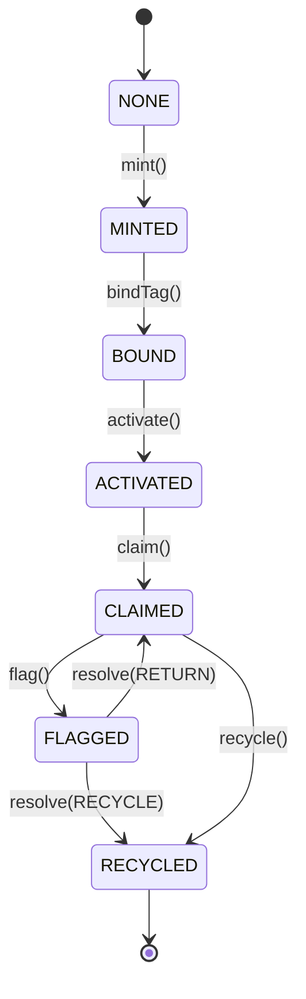
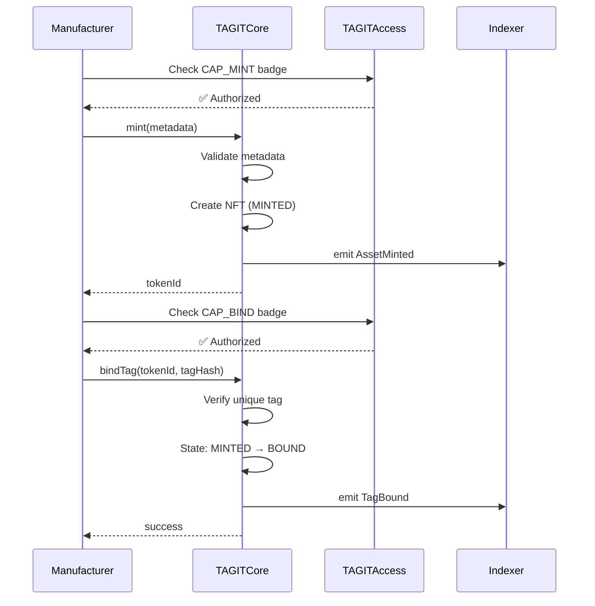
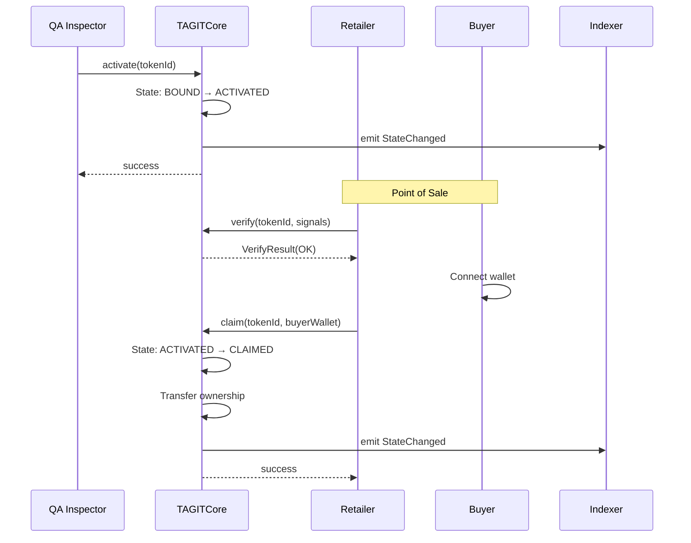

# Asset Lifecycle

**Last Updated:** January 2026 | **Version:** 2.0

Every physical product authenticated by TAG IT Network follows a deterministic 7-function lifecycle. This document details the state transitions, function signatures, and business rules governing asset movement through the system.

---

## Lifecycle State Machine



---

## State Definitions

| State | Code | Description | Allowed Transitions |
|-------|------|-------------|---------------------|
| `NONE` | 0 | Asset does not exist | → MINTED |
| `MINTED` | 1 | NFT created, metadata stored | → BOUND |
| `BOUND` | 2 | NFC tag cryptographically linked | → ACTIVATED |
| `ACTIVATED` | 3 | QA passed, available for sale | → CLAIMED |
| `CLAIMED` | 4 | Consumer owns the asset | → FLAGGED, RECYCLED |
| `FLAGGED` | 5 | Lost, stolen, or recalled | → CLAIMED, RECYCLED |
| `RECYCLED` | 6 | End of life, tag decommissioned | Terminal state |

---

## The 7 Core Functions

### 1. `mint(metadata)` — Create Digital Twin

**Purpose:** Creates the on-chain NFT representing a physical product.

**Caller:** Manufacturer (requires `CAP_MINT` badge)

**State Transition:** `NONE → MINTED`

```solidity
function mint(
    string calldata productId,
    string calldata sku,
    bytes32 metadataHash,
    string calldata metadataURI
) external returns (uint256 tokenId);
```

**Events Emitted:**
- `AssetMinted(tokenId, manufacturer, metadataHash)`

**Gas Cost:** ~135,000

---

### 2. `bindTag(tokenId, tagHash)` — Link NFC Chip

**Purpose:** Cryptographically binds the physical NFC tag to the digital twin.

**Caller:** Manufacturer (requires `CAP_BIND` badge)

**State Transition:** `MINTED → BOUND`

```solidity
function bindTag(
    uint256 tokenId,
    bytes32 tagHash,
    bytes calldata signature
) external;
```

**Validation:**
- Tag hash must be unique (never bound before)
- Signature must validate against tag's public key
- Token must be in MINTED state

**Events Emitted:**
- `TagBound(tokenId, tagHash, timestamp)`

**Gas Cost:** ~191,000

---

### 3. `activate(tokenId)` — Quality Assurance Pass

**Purpose:** Marks the product as QA-verified and ready for retail.

**Caller:** Distributor, QA Inspector, or Retailer (requires `CAP_ACTIVATE` badge)

**State Transition:** `BOUND → ACTIVATED`

```solidity
function activate(
    uint256 tokenId,
    bytes calldata qaSignature
) external;
```

**Events Emitted:**
- `StateChanged(tokenId, BOUND, ACTIVATED, activator)`

**Gas Cost:** ~198,000

---

### 4. `claim(tokenId, newOwner)` — Transfer Ownership

**Purpose:** Transfers ownership to the consumer at point of sale.

**Caller:** Retailer on behalf of consumer, or consumer directly

**State Transition:** `ACTIVATED → CLAIMED`

```solidity
function claim(
    uint256 tokenId,
    address newOwner,
    bytes calldata proofOfPurchase
) external;
```

**Events Emitted:**
- `StateChanged(tokenId, ACTIVATED, CLAIMED, claimer)`
- `Transfer(from, to, tokenId)` (ERC-721)

**Gas Cost:** ~217,000

---

### 5. `flag(tokenId, reason)` — Report Issue

**Purpose:** Marks an asset as lost, stolen, or subject to recall.

**Caller:** Owner, Law Enforcement, or Manufacturer (requires `CAP_FLAG` badge)

**State Transition:** `CLAIMED → FLAGGED`

```solidity
function flag(
    uint256 tokenId,
    FlagReason reason,
    bytes calldata evidence
) external;

enum FlagReason {
    LOST,
    STOLEN,
    COUNTERFEIT_SUSPECTED,
    RECALL,
    CUSTOMS_HOLD
}
```

**Events Emitted:**
- `AssetFlagged(tokenId, reason, reporter, timestamp)`

**Gas Cost:** ~225,000

---

### 6. `resolve(tokenId, resolution)` — Dispute Resolution

**Purpose:** Resolves a flagged asset after investigation.

**Caller:** Arbitrator or DAO (requires `CAP_RESOLVE` badge)

**State Transition:** `FLAGGED → CLAIMED` or `FLAGGED → RECYCLED`

```solidity
function resolve(
    uint256 tokenId,
    Resolution resolution,
    address newOwner
) external;

enum Resolution {
    RETURN_TO_OWNER,
    TRANSFER_TO_CLAIMANT,
    RECYCLE,
    DESTROY
}
```

**Events Emitted:**
- `RecoveryResolved(tokenId, resolution, newOwner)`

**Gas Cost:** ~244,000

---

### 7. `recycle(tokenId)` — End of Life

**Purpose:** Decommissions the asset and NFC tag.

**Caller:** Owner or authorized recycler (requires `CAP_RECYCLE` badge)

**State Transition:** `CLAIMED → RECYCLED` or `FLAGGED → RECYCLED`

```solidity
function recycle(
    uint256 tokenId,
    bytes calldata recycleProof
) external;
```

**Effects:**
- Tag hash marked as "spent" (cannot be rebound)
- NFT metadata updated with recycle timestamp
- Optional: burn the NFT

**Events Emitted:**
- `AssetRecycled(tokenId, recycler, timestamp)`

**Gas Cost:** ~225,000

---

## Sequence Diagrams

### Manufacturing Flow (MINT → BIND)



### Consumer Flow (ACTIVATE → CLAIM)



---

## Business Rules

### Immutable Constraints

1. **One Tag, One Token** — A tag hash can only be bound once, ever
2. **Forward Only** — State transitions are irreversible (except FLAGGED → CLAIMED)
3. **Capability Required** — Every function requires the appropriate badge
4. **Event Trail** — All transitions emit indexable events

### Configurable Parameters (DAO Governed)

| Parameter | Default | Range | Governance |
|-----------|---------|-------|------------|
| Quarantine Period | 48 hours | 24h - 168h | 51% vote |
| Recycle Cooldown | 30 days | 7d - 90d | 51% vote |
| Max Flags per Asset | 3 | 1-10 | 67% vote |

---

## Error Codes

| Code | Name | Description |
|------|------|-------------|
| `E001` | `InvalidState` | Asset not in required state for operation |
| `E002` | `Unauthorized` | Caller lacks required capability badge |
| `E003` | `TagAlreadyBound` | Tag hash already used |
| `E004` | `InvalidSignature` | NFC signature verification failed |
| `E005` | `QuarantineActive` | Asset under recovery investigation |

---

## Next Steps

- [BIDGES System](/docs/architecture/bidges-system) — Access control badges
- [Smart Contracts](/docs/smart-contracts/core-contracts) — TAGITCore implementation
- [Recovery Protocol](/docs/architecture/airp) — Lost/stolen asset handling
