# Data Flow Diagrams

**Last Updated:** January 2026 | **Version:** 2.0

Visual diagrams illustrating data flows, system architecture, and process sequences in TAG IT Network.

---

## 1. System Architecture Overview

---

## 2. Asset Lifecycle Sequences

### 2.1 REGISTER → MINT → BIND Flow

```mermaid
sequenceDiagram
    participant M as Manufacturer
    participant C as TAGITCore
    participant A as TAGITAccess
    participant I as Indexer

    M->>A: Check CAP_MINT badge
    A-->>M: ✅ Authorized
    
    M->>C: mint(metadata)
    C->>C: Validate metadata
    C->>C: Create NFT (MINTED)
    C->>I: emit AssetMinted
    C-->>M: tokenId

    M->>A: Check CAP_BIND badge
    A-->>M: ✅ Authorized
    
    M->>C: bindTag(tokenId, tagHash)
    C->>C: Verify unique tag
    C->>C: State: MINTED → BOUND
    C->>I: emit TagBound
    C-->>M: success
```

### 2.2 ACTIVATE → CLAIM Flow

```mermaid
sequenceDiagram
    participant QA as QA Inspector
    participant C as TAGITCore
    participant R as Retailer
    participant B as Buyer
    participant I as Indexer

    QA->>C: activate(tokenId)
    C->>C: State: BOUND → ACTIVATED
    C->>I: emit StateChanged
    C-->>QA: success

    Note over R,B: Point of Sale
    
    R->>C: verify(tokenId, signals)
    C-->>R: VerifyResult(OK)
    
    B->>B: Connect wallet
    R->>C: claim(tokenId, buyerWallet)
    C->>C: State: ACTIVATED → CLAIMED
    C->>C: Transfer ownership
    C->>I: emit StateChanged
    C-->>R: success
```

---

## 3. Verification Flow (Multi-Signal)

```mermaid
flowchart TD
    Start["User Scans NFC"] --> Read["Read Tag UID"]
    Read --> Challenge["Generate Challenge"]
    Challenge --> Sign["Chip Signs Challenge"]
    Sign --> Validate["Validate Signature"]
    
    Validate --> S1{"Signal 1:\nTag UID Match?"}
    S1 -->|No| Fail["VERIFICATION FAILED"]
    S1 -->|Yes| S2{"Signal 2:\nOwner Check?"}
    
    S2 -->|No| Fail
    S2 -->|Yes| S3{"Signal 3:\nValid State?"}
    
    S3 -->|No| Fail
    S3 -->|Yes| S4{"Signal 4:\nContext OK?"}
    
    S4 -->|No| Fail
    S4 -->|Yes| S5{"Signal 5:\nAI Score OK?"}
    
    S5 -->|No| Fail
    S5 -->|Yes| Pass["✅ VERIFIED"]
    
    Fail --> Alert["Log + Alert"]
```

---

## 4. Recovery Flow (AIRP)

---

## 5. Cross-Chain Message Flow (CCIP)

---

## 6. Contract Relationship Diagram

---

## 7. Deployment Pipeline Flow

---

## 8. Token Flow Diagram

```mermaid
flowchart TB
    subgraph GENESIS["🎰 GENESIS: 7,777,777,333 TAGIT"]
        ECO["🌱 Ecosystem\n35% · 2.72B"]
        PRE["💰 Presale\n20% · 1.56B"]
        TREAS["🏦 Treasury\n15% · 1.17B"]
        DAO["🏛️ DAO\n15% · 1.17B"]
        DEV["⚙️ Dev\n10% · 778M"]
        TEAM["👥 Team\n5% · 389M"]
    end

    subgraph EMISSIONS["📈 ANNUAL: +3.33%"]
        STAKE_R["Staking 40%"]
        GRANTS["Grants 30%"]
        TREAS_E["Treasury 20%"]
        DEV_E["Dev 10%"]
    end

    subgraph BURNS["🔥 BURNS: 33.3%"]
        FEES["Protocol Fees"]
        BURNED["Forever Gone"]
    end

    subgraph UTILITY["⚡ UTILITY"]
        GAS["Gas & Fees"]
        STAKE["Staking"]
        ACCESS["Access"]
    end

    GENESIS --> UTILITY
    EMISSIONS --> UTILITY
    UTILITY --> FEES
    FEES --> BURNED
```

---

## How to Use These Diagrams

1. **In Documentation**: Diagrams render automatically with Mermaid.js integration
2. **Interactive Editing**: Copy code to [mermaid.live](https://mermaid.live) for modifications
3. **Export**: Generate PNG/SVG from mermaid.live for presentations
4. **Embedding**: Use the raw code blocks in any Mermaid-compatible platform

---

## Next Steps

- [System Overview](/docs/architecture/system-overview) — Architecture details
- [Asset Lifecycle](/docs/architecture/asset-lifecycle) — State transitions
- [Smart Contracts](/docs/smart-contracts/overview) — Contract reference
