# Security Model

**Last Updated:** January 2026 | **Version:** 2.0 | **Compliance:** NIST CSF 2.0

TAG IT Network implements a 5-layer defense-in-depth security architecture designed to protect assets across the entire supply chain lifecycle.

---

## Defense-in-Depth Architecture

```
┌─────────────────────────────────────────────────────────────────┐
│  LAYER 5: GOVERNANCE                                            │
│  Multi-house DAO │ Timelocks │ Emergency Council │ Veto Power   │
├─────────────────────────────────────────────────────────────────┤
│  LAYER 4: APPLICATION                                           │
│  Rate Limiting │ Input Validation │ WAF │ DDoS Protection       │
├─────────────────────────────────────────────────────────────────┤
│  LAYER 3: ACCESS CONTROL (BIDGES)                               │
│  Identity Badges │ Capability Gates │ Zero-Knowledge Proofs     │
├─────────────────────────────────────────────────────────────────┤
│  LAYER 2: SMART CONTRACT                                        │
│  Formal Verification │ Reentrancy Guards │ Pausable │ Audits    │
├─────────────────────────────────────────────────────────────────┤
│  LAYER 1: CRYPTOGRAPHY                                          │
│  ECDSA Signatures │ Keccak256 Hashes │ AES-128 │ PQC (Future)   │
└─────────────────────────────────────────────────────────────────┘
```

---

## Layer 1: Cryptography

The foundation of all security in TAG IT Network.

### Current Implementation

| Algorithm | Use Case | Standard |
|-----------|----------|----------|
| **ECDSA secp256k1** | Transaction signing | Ethereum native |
| **Keccak256** | Hashing, tag binding | SHA-3 family |
| **AES-128** | NFC chip encryption | FIPS 197 |
| **CMAC** | Tag authentication | NIST SP 800-38B |

### Post-Quantum Readiness

TAG IT is preparing for quantum computer threats:

| Algorithm | Type | Status |
|-----------|------|--------|
| **Kyber** | Key encapsulation | Research |
| **Dilithium** | Digital signatures | Research |
| **SPHINCS+** | Hash-based signatures | Backup |

---

## Layer 2: Smart Contract Security

### Design Patterns

All contracts follow secure coding practices:

```solidity
// Checks-Effects-Interactions Pattern
function claim(uint256 tokenId, address newOwner) external {
    // CHECKS
    require(assets[tokenId].state == State.ACTIVATED, "Invalid state");
    require(access.hasCapability(msg.sender, CLAIMER_CAP), "Unauthorized");
    
    // EFFECTS
    assets[tokenId].state = State.CLAIMED;
    assets[tokenId].claimedAt = block.timestamp;
    
    // INTERACTIONS
    _transfer(ownerOf(tokenId), newOwner, tokenId);
    
    emit StateChanged(tokenId, State.ACTIVATED, State.CLAIMED, msg.sender);
}
```

### Security Features

| Feature | Implementation | Purpose |
|---------|----------------|---------|
| **Reentrancy Guards** | OpenZeppelin ReentrancyGuard | Prevent recursive calls |
| **Pausable** | OpenZeppelin Pausable | Emergency stop |
| **Access Control** | BIDGES system | Permission management |
| **Upgrade Safety** | UUPS Proxy | Controlled upgrades |
| **Input Validation** | Custom modifiers | Reject invalid data |

### Formal Verification

Critical functions undergo formal verification:

```
Verified Properties:
✅ State transitions are monotonic (no backward movement except resolve)
✅ Tag hash uniqueness is preserved globally
✅ Only authorized addresses can execute lifecycle functions
✅ Token supply invariants are maintained
```

### Audit Status

| Auditor | Scope | Status | Date |
|---------|-------|--------|------|
| **Slither** | Static analysis | ✅ 0 Critical/High/Medium | Jan 2026 |
| **Internal** | Full codebase | ✅ Complete | Jan 2026 |
| **External** | Core + Governance | 🔄 Scheduled | Q2 2026 |

---

## Layer 3: Access Control (BIDGES)

The BIDGES system enforces principle of least privilege:

### Identity Requirements

| Operation | Minimum Identity |
|-----------|------------------|
| Mint assets | MANUFACTURER badge |
| Activate assets | RETAILER badge |
| Flag assets | KYC_L1 or higher |
| Resolve disputes | GOV_MIL badge |
| Governance voting | Any Identity badge |

### Capability Isolation

```
┌─────────────────────────────────────────────────────────────────┐
│                    CAPABILITY ISOLATION                         │
├─────────────────────────────────────────────────────────────────┤
│                                                                 │
│  Manufacturer ──┬── MINT                                        │
│                 └── BIND                                        │
│                                                                 │
│  Retailer ─────── ACTIVATE                                      │
│                                                                 │
│  Consumer ──────┬── CLAIM                                       │
│                 └── FLAG (own assets only)                      │
│                                                                 │
│  Arbitrator ───── RESOLVE                                       │
│                                                                 │
│  Admin ────────── ALL (emergency only)                          │
│                                                                 │
└─────────────────────────────────────────────────────────────────┘
```

---

## Layer 4: Application Security

### API Protection

| Control | Implementation | NIST Mapping |
|---------|----------------|--------------|
| **Rate Limiting** | Token bucket algorithm | AC-7 |
| **Input Validation** | JSON Schema + sanitization | SI-10 |
| **Authentication** | JWT + refresh tokens | IA-2 |
| **Authorization** | RBAC + badge verification | AC-3 |
| **Encryption** | TLS 1.3 | SC-8 |
| **DDoS Protection** | Cloudflare + WAF | SC-5 |

### Rate Limits

| Endpoint | Limit | Window |
|----------|-------|--------|
| `/verify` | 100 | 1 minute |
| `/mint` | 10 | 1 minute |
| `/claim` | 50 | 1 minute |
| `/flag` | 5 | 1 minute |

### Logging & Monitoring

All security-relevant events are logged:

```javascript
{
  "timestamp": "2026-01-20T15:30:00Z",
  "event": "VERIFICATION_ATTEMPT",
  "tokenId": "12345",
  "scanner": "0x...",
  "result": "PASS",
  "signals": [true, true, true, true, true],
  "ip": "x.x.x.x",
  "userAgent": "...",
  "geoLocation": "US-CA"
}
```

---

## Layer 5: Governance Security

### Multi-House Checks

No single stakeholder group can dominate:

| Action | Requirement |
|--------|-------------|
| Standard change | 51% across houses |
| Critical change | 67% supermajority |
| Emergency action | 75% + council approval |

### Timelock Protections

```solidity
// All governance actions are time-delayed
uint256 constant STANDARD_DELAY = 7 days;
uint256 constant CRITICAL_DELAY = 14 days;
uint256 constant EMERGENCY_DELAY = 48 hours;
```

### Veto Powers

- **Gov/Mil House**: Can veto any proposal affecting defense applications
- **Emergency Council**: Can pause protocol for 72 hours
- **Core Developers**: Can block technically dangerous changes

---

## NIST CSF 2.0 Compliance

TAG IT Network aligns with NIST Cybersecurity Framework 2.0:

### IDENTIFY (ID)

| Control | Implementation |
|---------|----------------|
| ID.AM-1 | Asset inventory via Digital Twins |
| ID.AM-2 | Software inventory documented |
| ID.RA-1 | Threat modeling complete |

### PROTECT (PR)

| Control | Implementation |
|---------|----------------|
| PR.AA-1 | BIDGES identity management |
| PR.AA-5 | Multi-factor for admin |
| PR.DS-1 | AES-128 encryption |
| PR.DS-2 | TLS 1.3 in transit |

### DETECT (DE)

| Control | Implementation |
|---------|----------------|
| DE.AE-1 | Event correlation |
| DE.CM-1 | Network monitoring |
| DE.CM-4 | Code analysis |

### RESPOND (RS)

| Control | Implementation |
|---------|----------------|
| RS.AN-1 | Incident investigation |
| RS.MI-1 | CircuitBreaker pause |
| RS.MI-2 | Automated isolation |

### RECOVER (RC)

| Control | Implementation |
|---------|----------------|
| RC.RP-1 | Recovery procedures |
| RC.IM-1 | Lessons learned process |

---

## Threat Model

### Attack Vectors

| Vector | Mitigation | Status |
|--------|------------|--------|
| **Tag Cloning** | Cryptographic binding, CMAC signatures | ✅ Mitigated |
| **Replay Attacks** | Scan counter, timestamps | ✅ Mitigated |
| **Privilege Escalation** | BIDGES capability isolation | ✅ Mitigated |
| **Reentrancy** | Guards on all state changes | ✅ Mitigated |
| **Flash Loan Governance** | Snapshot voting | ✅ Mitigated |
| **51% Attack** | Multi-house voting weights | ✅ Mitigated |
| **Quantum Computing** | PQC migration planned | 🔄 In Progress |

### Incident Response

```mermaid
flowchart LR
    Detect["🔍 Detect"] --> Assess["📊 Assess"]
    Assess --> Contain["🛑 Contain"]
    Contain --> Eradicate["🧹 Eradicate"]
    Eradicate --> Recover["🔄 Recover"]
    Recover --> Learn["📝 Learn"]
```



---

## Security Contacts

| Type | Contact |
|------|---------|
| **Bug Bounty** | security@tagit.network |
| **Responsible Disclosure** | disclosure@tagit.network |
| **Emergency** | emergency@tagit.network |

---

## Next Steps

- [BIDGES System](/docs/architecture/bidges-system) — Access control details
- [Smart Contracts](/docs/smart-contracts/overview) — Contract security
- [DAO Governance](/docs/governance/dao-structure) — Governance security
