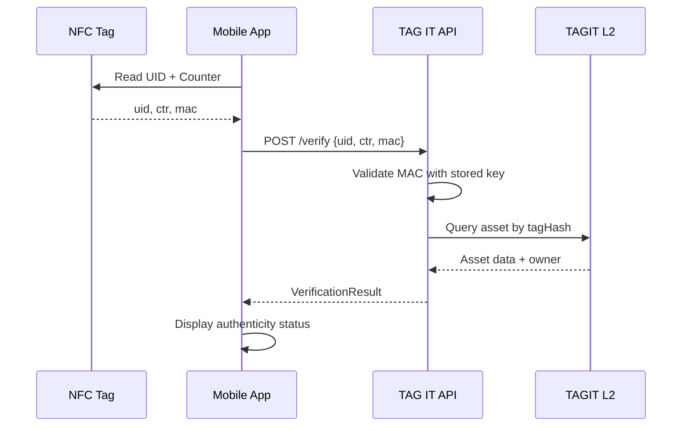

# NFC Hardware Architecture

**Last Updated:** January 2026 | **Version:** 2.0

TAG IT Network's hardware strategy defines the physical layer of the ORACULS stack — the NFC chips, readers, and manufacturing partnerships that enable cryptographic binding of physical assets to blockchain digital twins.

---

## Four-Tier Chip Classification

```
┌────────────────────────────────────────────────────────────────────────────┐
│                    TAG IT NFC CHIP HIERARCHY                               │
├────────────────────────────────────────────────────────────────────────────┤
│                                                                            │
│  ┌─────────────────────────────────────────────────────────────────────┐   │
│  │  CLASS 1: SOVEREIGN                                                 │   │
│  │  Chips: ICODE DNA, Infineon SLE78, Custom ASIC                      │   │
│  │  Security: FIPS 140-3 Level 3+, EAL5+                               │   │
│  │  Price: $8-25/tag                                                   │   │
│  │  Use: Defense, nuclear, critical infrastructure                     │   │
│  │  Features: HSM integration, multi-oracle, full audit trail          │   │
│  └─────────────────────────────────────────────────────────────────────┘   │
│                               │                                            │
│                               ▼                                            │
│  ┌─────────────────────────────────────────────────────────────────────┐   │
│  │  CLASS 2: FORTRESS                                                  │   │
│  │  Chips: NTAG 424 DNA (standard)                                     │   │
│  │  Security: AES-128, SUN authentication, EAL4+                       │   │
│  │  Price: $2-8/tag                                                    │   │
│  │  Use: Enterprise assets, high-value equipment                       │   │
│  │  Features: TagTamper, device certificates, full audit               │   │
│  └─────────────────────────────────────────────────────────────────────┘   │
│                               │                                            │
│                               ▼                                            │
│  ┌─────────────────────────────────────────────────────────────────────┐   │
│  │  CLASS 3: PRESTIGE                                                  │   │
│  │  Chips: NTAG 424 DNA (micro form factor)                            │   │
│  │  Security: AES-128, SUN authentication                              │   │
│  │  Price: $0.80-2/tag                                                 │   │
│  │  Use: Luxury goods, premium consumer, collectibles                  │   │
│  │  Features: App attestation, optional tamper, minimal audit          │   │
│  └─────────────────────────────────────────────────────────────────────┘   │
│                               │                                            │
│                               ▼                                            │
│  ┌─────────────────────────────────────────────────────────────────────┐   │
│  │  CLASS 4: COMMERCIAL                                                │   │
│  │  Chips: NTAG 216 + HMAC                                             │   │
│  │  Security: HMAC-SHA256 (software layer)                             │   │
│  │  Price: $0.15-0.50/tag                                              │   │
│  │  Use: Standard supply chain, inventory, logistics                   │   │
│  │  Features: Basic verification, no tamper detection                  │   │
│  └─────────────────────────────────────────────────────────────────────┘   │
│                                                                            │
└────────────────────────────────────────────────────────────────────────────┘
```

---

## NTAG 424 DNA — The Workhorse Chip

The **NTAG 424 DNA** is TAG IT's primary chip for CLASS 2 and CLASS 3 applications. It provides hardware-backed cryptographic authentication at commercial price points.

### Key Specifications

| Parameter | Value |
|-----------|-------|
| **Manufacturer** | NXP Semiconductors |
| **User Memory** | 416 bytes |
| **UID** | 7 bytes (unique, read-only) |
| **Cryptography** | AES-128 (5 customer keys) |
| **Authentication** | SUN (Secure Unique NFC) |
| **Write Endurance** | 200,000 cycles |
| **Data Retention** | 50 years |
| **Certification** | Common Criteria EAL4+ |
| **Read Distance** | Up to 10cm |
| **Protocols** | ISO/IEC 14443-A, NFC Forum Type 4 |
| **Data Rate** | Up to 848 kbit/s |

### SUN (Secure Unique NFC) Authentication

SUN provides cryptographic proof that a tag is genuine and hasn't been cloned:

```
URL Format:
https://verify.tagit.network/v?uid=04A1B2C3D4E5F6&ctr=000001&mac=A1B2C3D4E5F6A1B2

Components:
├── uid: 7-byte unique chip identifier (read-only)
├── ctr: 3-byte rolling counter (increments each read)
└── mac: 8-byte AES-CMAC signature (cryptographic proof)
```

**Security Properties:**
- **Anti-cloning**: MAC is derived from secret key stored in secure memory
- **Anti-replay**: Rolling counter prevents capture-and-replay attacks
- **Tamper-evident**: TagTamper variant detects physical tampering

---

## Reader Ecosystem

### Reader Categories

| Category | Use Case | Examples | Price Range |
|----------|----------|----------|-------------|
| **Mobile** | Consumer verification (85%) | Any NFC smartphone | $0 (built-in) |
| **Desktop** | Development, enrollment | ACR1252U, ACR122U | $50-150 |
| **Enterprise Handheld** | Warehouse, logistics | Zebra TC52x, TC72x | $800-2,500 |
| **Fixed Infrastructure** | Automated checkpoints | Impinj, Alien | $1,000-5,000 |
| **Retail POS** | Luxury boutiques | Socket Mobile S550 | $250-400 |

### Recommended Development Setup

```
┌────────────────────────────────────────────────────────────────────────────┐
│                    DEVELOPER HARDWARE KIT                                  │
├────────────────────────────────────────────────────────────────────────────┤
│                                                                            │
│  1. NTAG 424 DNA Starter Kit (GoToTags)              $50-100               │
│     └── 10-25 mixed tags (labels, cards, keyfobs)                          │
│                                                                            │
│  2. ACR1252U USB NFC Reader                          $80-100               │
│     └── PC/SC compliant, SDK available                                     │
│                                                                            │
│  3. NFC-enabled smartphone                           (existing)            │
│     └── Android preferred (better NFC APIs)                                │
│                                                                            │
│  TOTAL INVESTMENT: ~$130-200                                               │
│                                                                            │
└────────────────────────────────────────────────────────────────────────────┘
```

---

## Manufacturing Partners

### Tier 1 — Chip Manufacturers

| Company | Products | HQ | U.S. Presence | Defense Capable |
|---------|----------|-----|---------------|-----------------|
| **NXP Semiconductors** | NTAG 424 DNA, ICODE DNA | Netherlands | Austin, TX fab | ✅ |
| **Infineon Technologies** | SLE78, SECORA | Germany | San Jose design | ✅ FIPS ready |
| **STMicroelectronics** | ST25TA, ST25TV | Switzerland | Scottsdale, AZ | ⚠️ Limited |

### Tier 2 — Tag Converters

| Company | Specialty | Location | MOQ | Price Range |
|---------|-----------|----------|-----|-------------|
| **Smartrac (Avery Dennison)** | High-volume, U.S. supply | Jacksonville, FL | 5K | $0.20-5/tag |
| **HID Global** | Defense, FIPS | Austin, TX | 1K | $2-10/tag |
| **Identiv** | Specialty tags | Fremont, CA | 2.5K | $0.50-4/tag |
| **GoToTags** | Small batch, fast turn | U.S. | 100 | $0.45-2/tag |

### U.S. Supply Chain Strategy

```
CLASS 1 (SOVEREIGN):     100% U.S. sourcing required
├── Chip: NXP Austin or Infineon San Jose
├── Conversion: HID Global Austin
└── Enclosure: U.S. specialty manufacturer

CLASS 2 (FORTRESS):      U.S. preferred, allied nations acceptable
├── Chip: NXP (Netherlands OK, Austin preferred)
└── Conversion: Smartrac Jacksonville

CLASS 3-4 (PRESTIGE/COMMERCIAL): Global sourcing acceptable
└── Cost optimization with quality controls
```

---

## Pricing Summary

### Tag Costs by Class and Volume

| Volume | CLASS 1 | CLASS 2 | CLASS 3 | CLASS 4 |
|--------|---------|---------|---------|---------|
| Pilot (100-500) | $20-25 | $5-8 | $1.50-2 | $0.40-0.50 |
| Small (1K-5K) | $15-20 | $3-5 | $1-1.50 | $0.25-0.35 |
| Medium (5K-25K) | $12-18 | $2-4 | $0.80-1.20 | $0.18-0.25 |
| Large (25K-100K) | $10-15 | $1.50-3 | $0.60-0.90 | $0.15-0.20 |
| Volume (100K+) | $8-12 | $1-2 | $0.45-0.70 | $0.12-0.18 |

### Additional Service Costs

| Service | Cost | Notes |
|---------|------|-------|
| Key provisioning | +$0.05-0.15/tag | AES key injection |
| NDEF encoding | +$0.02-0.05/tag | URL configuration |
| Custom printing | +$0.05-0.20/tag | Logos, serial numbers |
| TagTamper upgrade | +20-30% | NTAG 424 DNA TT variant |
| On-metal tags | +20-40% | Ferrite shielding |

---

## COTS vs Custom Hardware

| Capability | COTS (Today) | Custom (2026+) |
|------------|--------------|----------------|
| Authentication | ✅ NTAG 424 DNA | ✅ SIGMA BOY |
| Tamper detection | ✅ TagTamper | ✅ Active mesh |
| Temperature range | ⚠️ -25°C to +70°C | ✅ -269°C to +300°C |
| Radiation hardness | ❌ None | ✅ 1 Mrad TID |
| PQC cryptography | ❌ None | ✅ Kyber/Dilithium |
| Energy harvesting | ❌ Passive only | ✅ Quad-source |
| Active beacon | ❌ No | ✅ PING mode |

**Strategy:** Launch with COTS (80% of use cases), develop custom SIGMA BOY for defense/space (20% premium market).

---

## NFC → Blockchain Binding Flow



---

## Next Steps

- [NFC Integration Guide](/docs/tutorials/nfc-integration) — How to integrate NFC scanning
- [SDK Reference](/docs/sdk/nfc-sdk) — NFC SDK documentation
- [Chip Selection Guide](/docs/nfc/chip-selection) — Choosing the right chip class
