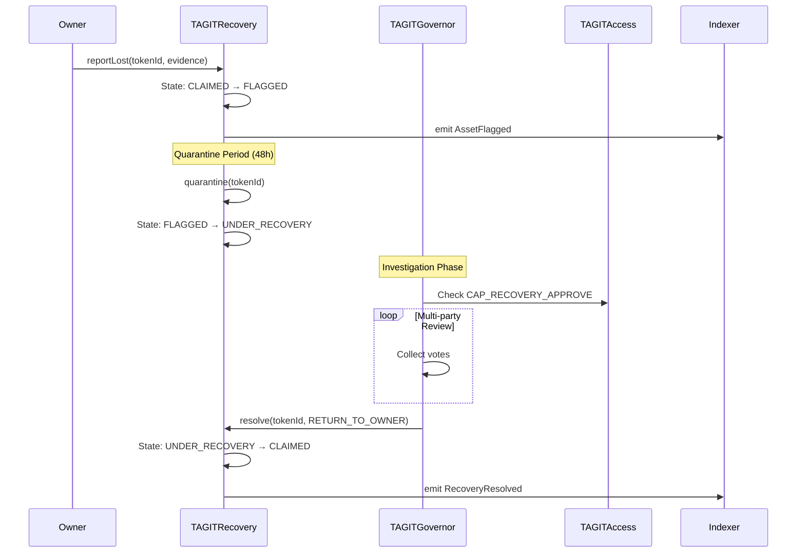

# Core Contracts

**Last Updated:** January 2026 | **Version:** 2.0

The core contracts form the foundation of TAG IT Network's product authentication system. These three contracts handle asset lifecycle management, access control, and recovery operations.

---

## TAGITCore.sol

The primary contract managing digital twin NFTs and their lifecycle states.

### Overview

| Property | Value |
|----------|-------|
| **Standard** | ERC-721 (with extensions) |
| **Lines of Code** | ~450 |
| **Dependencies** | TAGITAccess, LifecycleLib |
| **Upgradeability** | UUPS Proxy |

### State Variables

```solidity
// Asset storage
mapping(uint256 => Asset) public assets;
mapping(bytes32 => uint256) public tagHashToToken;
mapping(bytes32 => bool) public usedTagHashes;

// Counters
uint256 private _tokenIdCounter;

// Access control
ITAGITAccess public immutable access;

struct Asset {
    bytes32 tagHash;
    uint8 state;
    uint256 mintedAt;
    uint256 boundAt;
    uint256 activatedAt;
    uint256 claimedAt;
    bytes32 metadataHash;
    string metadataURI;
}
```

### Core Functions

#### mint()

Creates a new digital twin NFT.

```solidity
function mint(
    string calldata productId,
    string calldata sku,
    bytes32 metadataHash,
    string calldata metadataURI
) external requiresCapability(MINTER_CAP) returns (uint256 tokenId) {
    tokenId = ++_tokenIdCounter;
    
    assets[tokenId] = Asset({
        tagHash: bytes32(0),
        state: uint8(State.MINTED),
        mintedAt: block.timestamp,
        boundAt: 0,
        activatedAt: 0,
        claimedAt: 0,
        metadataHash: metadataHash,
        metadataURI: metadataURI
    });
    
    _safeMint(msg.sender, tokenId);
    
    emit AssetMinted(tokenId, msg.sender, metadataHash, metadataURI);
}
```

#### bindTag()

Cryptographically binds an NFC tag to the digital twin.

```solidity
function bindTag(
    uint256 tokenId,
    bytes32 tagHash,
    bytes calldata signature
) external requiresCapability(BINDER_CAP) {
    Asset storage asset = assets[tokenId];
    
    // Validate state
    if (asset.state != uint8(State.MINTED)) revert InvalidState();
    
    // Ensure tag hasn't been used before
    if (usedTagHashes[tagHash]) revert TagAlreadyBound();
    
    // Verify NFC signature (optional for high-security mode)
    if (signature.length > 0) {
        _verifyTagSignature(tagHash, signature);
    }
    
    // Bind the tag
    asset.tagHash = tagHash;
    asset.state = uint8(State.BOUND);
    asset.boundAt = block.timestamp;
    
    tagHashToToken[tagHash] = tokenId;
    usedTagHashes[tagHash] = true;
    
    emit TagBound(tokenId, tagHash, block.timestamp);
}
```

#### verify()

Multi-signal verification for authenticity checks.

```solidity
function verify(
    uint256 tokenId,
    VerifyParams calldata params
) external view returns (VerifyResult memory) {
    Asset storage asset = assets[tokenId];
    
    VerifyResult memory result;
    result.tokenId = tokenId;
    result.signals = new bool[](5);
    
    // Signal 1: Tag UID matches
    result.signals[0] = (asset.tagHash == params.tagHash);
    
    // Signal 2: Caller is owner (or authorized)
    result.signals[1] = (ownerOf(tokenId) == params.scanner) 
        || access.hasCapability(params.scanner, VERIFIER_CAP);
    
    // Signal 3: Valid lifecycle state
    result.signals[2] = (asset.state >= uint8(State.ACTIVATED) 
        && asset.state <= uint8(State.CLAIMED));
    
    // Signal 4: Context signals (geo/time plausibility)
    result.signals[3] = _validateContext(params.context);
    
    // Signal 5: Not flagged
    result.signals[4] = (asset.state != uint8(State.FLAGGED));
    
    // Calculate overall result
    result.passed = result.signals[0] && result.signals[1] 
        && result.signals[2] && result.signals[3] && result.signals[4];
    
    return result;
}
```

### Events

```solidity
event AssetMinted(
    uint256 indexed tokenId, 
    address indexed manufacturer, 
    bytes32 metadataHash,
    string metadataURI
);

event TagBound(
    uint256 indexed tokenId, 
    bytes32 indexed tagHash, 
    uint256 timestamp
);

event StateChanged(
    uint256 indexed tokenId, 
    uint8 fromState, 
    uint8 toState, 
    address indexed actor
);

event AssetFlagged(
    uint256 indexed tokenId, 
    uint8 reason, 
    address indexed reporter
);

event AssetRecycled(
    uint256 indexed tokenId, 
    address indexed recycler
);
```

---

## TAGITAccess.sol

The unified facade for the BIDGES access control system.

### Overview

| Property | Value |
|----------|-------|
| **Standard** | Custom (wraps ERC-5192 + ERC-1155) |
| **Lines of Code** | ~210 |
| **Dependencies** | IdentityBadge, CapabilityBadge |
| **Upgradeability** | UUPS Proxy |

### Key Functions

```solidity
// Check if address has a capability
function hasCapability(
    address account, 
    bytes32 capability
) external view returns (bool) {
    return capabilityBadge.balanceOf(account, uint256(capability)) > 0;
}

// Require capability (reverts if not held)
function requireCapability(
    address account, 
    bytes32 capability
) external view {
    if (!hasCapability(account, capability)) {
        revert Unauthorized(account, capability);
    }
}

// Grant capability to an address
function grantCapability(
    address account,
    bytes32 capability,
    uint256 amount
) external onlyRole(ADMIN_ROLE) {
    capabilityBadge.mint(account, uint256(capability), amount, "");
    emit CapabilityGranted(account, capability, amount);
}

// Revoke capability
function revokeCapability(
    address account,
    bytes32 capability
) external onlyRole(ADMIN_ROLE) {
    uint256 balance = capabilityBadge.balanceOf(account, uint256(capability));
    capabilityBadge.burn(account, uint256(capability), balance);
    emit CapabilityRevoked(account, capability);
}
```

### Capability Constants

```solidity
bytes32 public constant MINTER_CAP = keccak256("MINTER");
bytes32 public constant BINDER_CAP = keccak256("BINDER");
bytes32 public constant ACTIVATOR_CAP = keccak256("ACTIVATOR");
bytes32 public constant CLAIMER_CAP = keccak256("CLAIMER");
bytes32 public constant FLAGGER_CAP = keccak256("FLAGGER");
bytes32 public constant RESOLVER_CAP = keccak256("RESOLVER");
bytes32 public constant RECYCLER_CAP = keccak256("RECYCLER");
```

---

## TAGITRecovery.sol

Handles the AIRP (AI Recovery Protocol) for lost, stolen, or disputed assets.

### Overview

| Property | Value |
|----------|-------|
| **Standard** | Custom |
| **Lines of Code** | ~320 |
| **Dependencies** | TAGITCore, TAGITAccess, TAGITGovernor |
| **Upgradeability** | UUPS Proxy |

### Recovery Flow



### Key Functions

```solidity
// Report an asset as lost/stolen
function reportLost(
    uint256 tokenId,
    bytes calldata evidence
) external {
    // Only owner can report
    if (core.ownerOf(tokenId) != msg.sender) revert NotOwner();
    
    // Flag the asset
    _flagAsset(tokenId, FlagReason.LOST, evidence);
    
    // Start quarantine timer
    quarantineEnd[tokenId] = block.timestamp + QUARANTINE_PERIOD;
    
    emit LostReported(tokenId, msg.sender, evidence);
}

// Resolve a recovery case
function resolve(
    uint256 tokenId,
    Resolution resolution,
    address newOwner
) external requiresCapability(RESOLVER_CAP) {
    if (resolution == Resolution.RETURN_TO_OWNER) {
        _returnToOwner(tokenId);
    } else if (resolution == Resolution.TRANSFER_TO_CLAIMANT) {
        _transferToClaimant(tokenId, newOwner);
    } else if (resolution == Resolution.RECYCLE) {
        _recycleAsset(tokenId);
    }
    
    emit RecoveryResolved(tokenId, resolution, newOwner);
}
```

### Transfer Gate

The TransferGate is a security mechanism that can pause or restrict transfers during disputes:

```solidity
// Check if transfer is allowed
function canTransfer(
    uint256 tokenId,
    address from,
    address to
) external view returns (bool) {
    // Check if asset is under recovery
    if (underRecovery[tokenId]) return false;
    
    // Check if quarantine is active
    if (block.timestamp < quarantineEnd[tokenId]) return false;
    
    // Check transfer restrictions
    if (transferRestrictions[tokenId].restricted) {
        return transferRestrictions[tokenId].allowedRecipient == to;
    }
    
    return true;
}
```

---

## Deployment

### Constructor Parameters

```solidity
// TAGITCore
constructor(
    address accessContract,
    string memory name,
    string memory symbol
)

// TAGITAccess  
constructor(
    address identityBadge,
    address capabilityBadge
)

// TAGITRecovery
constructor(
    address coreContract,
    address accessContract,
    address governorContract,
    uint256 quarantinePeriod
)
```

### Initialization Sequence

```
1. Deploy IdentityBadge
2. Deploy CapabilityBadge
3. Deploy TAGITAccess(identityBadge, capabilityBadge)
4. Deploy TAGITGovernor
5. Deploy TAGITCore(access, "TAG IT Asset", "TAGIT")
6. Deploy TAGITRecovery(core, access, governor, 48 hours)
7. Grant initial capabilities
```

---

## Next Steps

- [Token Contracts](/docs/smart-contracts/token-contracts) — ERC-20 and badges
- [Governance Contracts](/docs/smart-contracts/governance) — DAO and treasury
- [ABI Reference](/docs/smart-contracts/abi-reference) — Full ABI documentation
