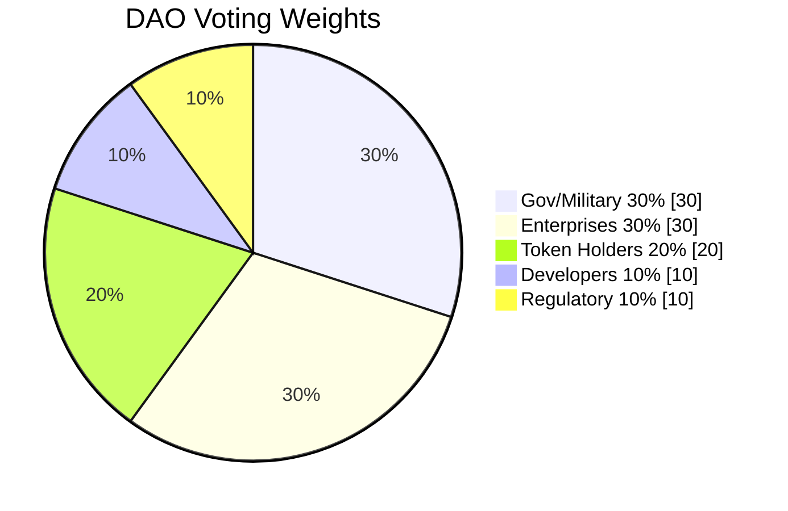
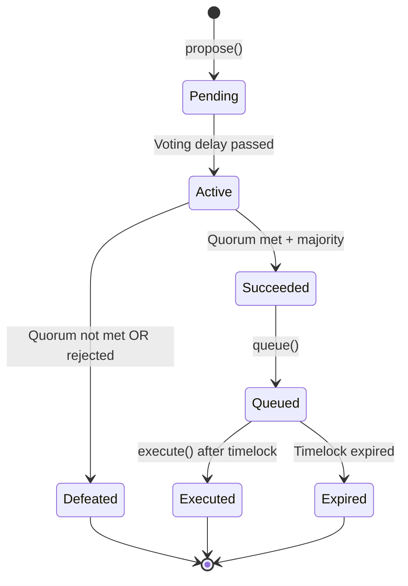
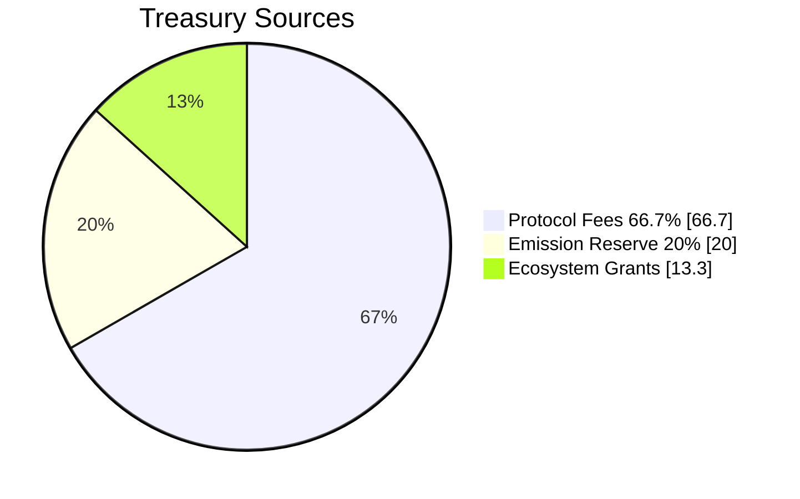

# DAO Governance Structure

**Last Updated:** January 2026 | **Version:** 2.0

TAG IT Network uses a multi-house DAO governance model that balances stakeholder interests across government, enterprise, public, developer, and regulatory constituencies.

---

## Multi-House Voting System

Unlike traditional one-token-one-vote DAOs, TAG IT implements weighted voting across five stakeholder houses:



### House Weights

| House | Weight | Basis Points | Rationale |
|-------|--------|--------------|-----------|
| **U.S. Government / Military** | 30% | 3000 | Safety-critical veto power |
| **Enterprises / Manufacturers** | 30% | 3000 | Brand partner alignment |
| **Token Holders (Public)** | 20% | 2000 | Community voice |
| **Core Developers** | 10% | 1000 | Technical guidance |
| **Regulatory / Compliance** | 10% | 1000 | Legal and compliance voice |

---

## Why Multi-House?

Traditional crypto DAOs suffer from plutocracy — wealthy token holders dominate governance. TAG IT's hybrid model ensures:

1. **Safety-Critical Operations** — Gov/Mil house can veto dangerous proposals
2. **Enterprise Alignment** — Brand partners have meaningful input
3. **Community Voice** — Public token holders maintain influence
4. **Technical Quality** — Developers guide protocol evolution
5. **Compliance Assurance** — Regulatory experts prevent legal issues

---

## Governance Parameters

### Proposal Thresholds

| Action | Requirement | Timelock |
|--------|-------------|----------|
| Standard proposal | 51% majority | 7 days |
| Parameter change | 51% majority | 7 days |
| Treasury withdrawal (< $100K) | 51% majority | 7 days |
| Treasury withdrawal (> $100K) | 67% supermajority | 14 days |
| Protocol upgrade | 67% supermajority | 14 days |
| Emergency action | 75% supermajority | 48 hours |
| Burn rate decrease | 67% supermajority | 30 days |

### Timelock Periods

```solidity
uint256 constant STANDARD_TIMELOCK = 7 days;
uint256 constant EXTENDED_TIMELOCK = 14 days;
uint256 constant BURN_CHANGE_TIMELOCK = 30 days;
uint256 constant EMERGENCY_TIMELOCK = 48 hours;
```

---

## TAGITGovernor Contract

### Overview

| Property | Value |
|----------|-------|
| **Base** | OpenZeppelin Governor |
| **Voting Token** | TAGITToken (ERC-20) |
| **Voting Period** | 7 days |
| **Proposal Threshold** | 100,000 TAGIT |
| **Quorum** | 4% of total supply |

### Key Functions

```solidity
// Create a new proposal
function propose(
    address[] memory targets,
    uint256[] memory values,
    bytes[] memory calldatas,
    string memory description
) public override returns (uint256 proposalId);

// Cast vote with house affiliation
function castVoteWithHouse(
    uint256 proposalId,
    uint8 support,
    House house
) public returns (uint256 weight);

// Execute passed proposal (after timelock)
function execute(
    address[] memory targets,
    uint256[] memory values,
    bytes[] memory calldatas,
    bytes32 descriptionHash
) public payable override returns (uint256 proposalId);
```

### House Membership

```solidity
enum House {
    GOV_MIL,      // 0 - Government/Military
    ENTERPRISE,   // 1 - Enterprises/Manufacturers
    PUBLIC,       // 2 - Token Holders
    DEVELOPER,    // 3 - Core Developers
    REGULATORY    // 4 - Regulatory/Compliance
}

// Mapping of addresses to their house
mapping(address => House) public houseOf;

// Register house membership (requires verification)
function setHouseMembership(
    address member,
    House house
) external onlyRole(HOUSE_ADMIN_ROLE);
```

---

## Proposal Lifecycle



### Proposal States

| State | Description |
|-------|-------------|
| **Pending** | Proposal created, waiting for voting delay |
| **Active** | Voting in progress |
| **Succeeded** | Voting passed, ready to queue |
| **Defeated** | Voting failed |
| **Queued** | In timelock waiting period |
| **Executed** | Proposal executed |
| **Expired** | Timelock expired without execution |
| **Cancelled** | Cancelled by proposer or guardian |

---

## Burn Rate Governance

The TAGIT token burn rate is a critical parameter with special governance rules:

### Burn Parameters

| Parameter | Value | Governance |
|-----------|-------|------------|
| **Default Rate** | 33.3% | DAO-adjustable |
| **Floor (Min)** | 3.33% | 🔒 Immutable |
| **Ceiling (Max)** | 100% | DAO-adjustable |

### Burn Change Rules

| Action | Requirement | Timelock |
|--------|-------------|----------|
| ⬆️ Increase burn | 51% majority | 7 days |
| ⬇️ Decrease burn | 67% supermajority | 30 days |
| ❌ Below 3.33% | **IMPOSSIBLE** | Immutable |

```solidity
// Immutable burn floor
uint256 constant BURN_FLOOR = 333; // 3.33% in basis points

function setBurnRate(uint256 newRate) external onlyGovernance {
    if (newRate < BURN_FLOOR) revert BurnFloorViolation();
    // ... rest of implementation
}
```

---

## TAGITTreasury Contract

### Overview

| Property | Value |
|----------|-------|
| **Type** | Timelock Controller |
| **Multi-sig** | 3-of-5 for emergency |
| **Delay** | Matches proposal timelock |

### Treasury Allocations



### Key Functions

```solidity
// Withdraw funds (requires governance approval)
function withdraw(
    address token,
    address recipient,
    uint256 amount
) external onlyRole(GOVERNANCE_ROLE);

// Allocate to programs
function allocate(
    address program,
    uint256 amount
) external onlyRole(GOVERNANCE_ROLE);

// Emergency withdrawal (multi-sig only)
function emergencyWithdraw(
    address token,
    address recipient,
    uint256 amount
) external onlyRole(EMERGENCY_ROLE);
```

---

## Emergency Council

For critical security incidents, an Emergency Council can act with reduced timelock:

### Council Composition

| Role | Count | Selection |
|------|-------|-----------|
| Gov/Mil Representative | 1 | Appointed |
| Enterprise Representative | 1 | Appointed |
| Core Developer | 1 | Elected |
| Security Expert | 1 | Appointed |
| Legal/Compliance | 1 | Appointed |

### Emergency Powers

- **Pause Protocol** — Halt all transactions (48h timelock)
- **Blacklist Address** — Block malicious actors (48h timelock)
- **Emergency Upgrade** — Critical security patches (72h timelock)

### Limitations

Emergency Council **cannot**:
- Modify burn floor
- Change house weights
- Withdraw > $1M without full governance
- Act without on-chain record

---

## Voting Power Calculation

```solidity
function getVotingPower(
    address account,
    uint256 proposalId
) public view returns (uint256) {
    // Get token balance at proposal snapshot
    uint256 tokenBalance = token.getPastVotes(
        account, 
        proposalSnapshot(proposalId)
    );
    
    // Get house membership
    House house = houseOf[account];
    
    // Calculate weighted voting power
    uint256 houseWeight = houseWeights[house];
    uint256 houseTotalTokens = houseTotals[house];
    
    // Pro-rata share of house allocation
    return (tokenBalance * houseWeight) / houseTotalTokens;
}
```

---

## Deployed Contracts

### OP Sepolia Testnet

| Contract | Address | Status |
|----------|---------|--------|
| **TAGITGovernor** | `0x...` | ✅ Verified |
| **TAGITTreasury** | `0x...` | ✅ Verified |
| **Timelock** | `0x...` | ✅ Verified |

---

## Next Steps

- [TAGIT Token](/docs/tokenomics/tagit-token) — Tokenomics and supply
- [BIDGES System](/docs/architecture/bidges-system) — Access control
- [Smart Contracts](/docs/smart-contracts/overview) — Full contract reference
