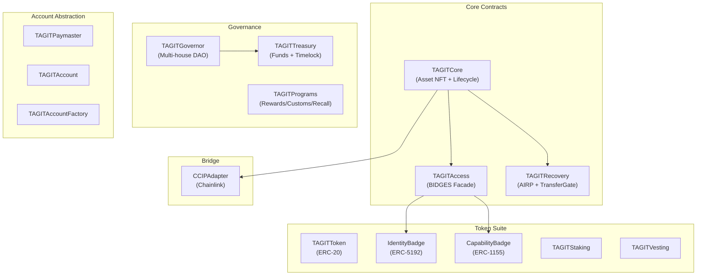
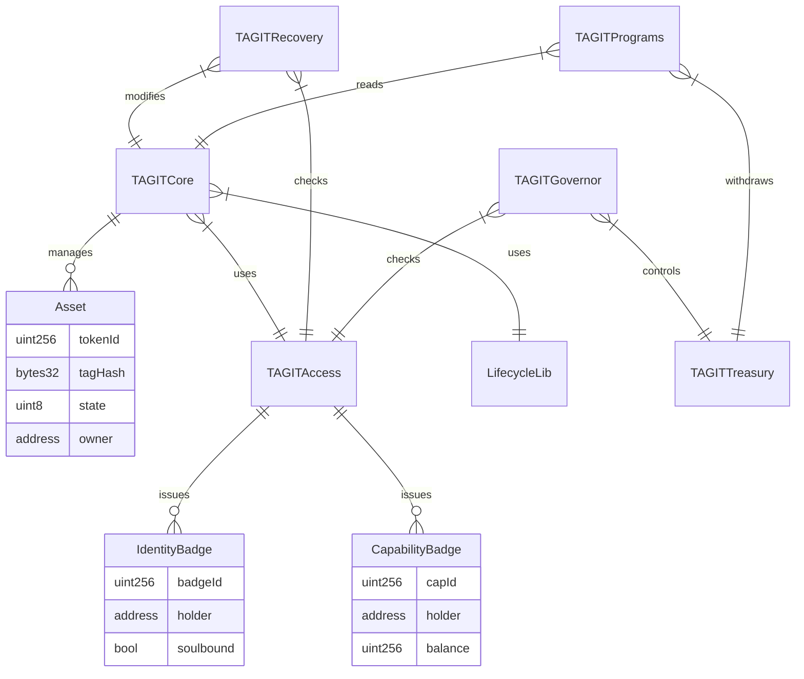

# Smart Contracts Overview

**Last Updated:** January 2026 | **Version:** 2.0 | **Network:** OP Stack L2

TAG IT Network's smart contract architecture consists of 15 contracts organized into four functional groups: Core, Token Suite, Account Abstraction, and Bridge.

---

## Contract Architecture



---

## Contract Groups

### Core Contracts (3)

| Contract | Purpose | Key Functions |
|----------|---------|---------------|
| **TAGITCore** | Asset NFT + Lifecycle management | `mint`, `bindTag`, `activate`, `claim`, `flag`, `resolve`, `recycle` |
| **TAGITAccess** | BIDGES access control facade | `hasCapability`, `requireCapability`, `grantCapability` |
| **TAGITRecovery** | Lost/stolen asset recovery (AIRP) | `reportLost`, `quarantine`, `resolve`, `transferGate` |

### Governance Contracts (3)

| Contract | Purpose | Key Functions |
|----------|---------|---------------|
| **TAGITGovernor** | Multi-house DAO voting | `propose`, `vote`, `execute`, `setHouseWeight` |
| **TAGITTreasury** | Protocol funds + timelock | `withdraw`, `allocate`, `setTimelock` |
| **TAGITPrograms** | Rewards, Customs, Recall programs | `claimReward`, `customsHold`, `initiateRecall` |

### Token Suite (5)

| Contract | Standard | Purpose |
|----------|----------|---------|
| **TAGITToken** | ERC-20 | Utility token with mint/burn |
| **IdentityBadge** | ERC-5192 | Soulbound identity tokens |
| **CapabilityBadge** | ERC-1155 | Transferable capability tokens |
| **TAGITStaking** | Custom | Stake tokens for rewards |
| **TAGITVesting** | Custom | Team/investor vesting schedules |

### Account Abstraction (3)

| Contract | Standard | Purpose |
|----------|----------|---------|
| **TAGITPaymaster** | ERC-4337 | Sponsor gas for users |
| **TAGITAccount** | ERC-4337 | Smart contract wallet |
| **TAGITAccountFactory** | ERC-4337 | Deploy user accounts |

### Bridge (1)

| Contract | Protocol | Purpose |
|----------|----------|---------|
| **CCIPAdapter** | Chainlink CCIP | Cross-chain messaging |

---

## Dependency Graph



---

## Library Contracts

Shared utility libraries used across the protocol:

| Library | Purpose | Used By |
|---------|---------|---------|
| **LifecycleLib** | State machine transitions | TAGITCore |
| **EventLib** | Standardized event definitions | All contracts |
| **AccessLib** | Permission bitmask operations | TAGITAccess |
| **CryptoLib** | Hash functions + PQC hooks | TAGITCore, Recovery |

---

## Repository Structure

```
tagit-contracts/
├── src/
│   ├── core/
│   │   ├── TAGITCore.sol
│   │   ├── TAGITAccess.sol
│   │   └── TAGITRecovery.sol
│   ├── governance/
│   │   ├── TAGITGovernor.sol
│   │   └── TAGITTreasury.sol
│   ├── programs/
│   │   └── TAGITPrograms.sol
│   ├── tokens/
│   │   ├── TAGITToken.sol
│   │   ├── IdentityBadge.sol
│   │   ├── CapabilityBadge.sol
│   │   ├── TAGITStaking.sol
│   │   └── TAGITVesting.sol
│   ├── aa/
│   │   ├── TAGITPaymaster.sol
│   │   ├── TAGITAccount.sol
│   │   └── TAGITAccountFactory.sol
│   ├── bridge/
│   │   └── CCIPAdapter.sol
│   ├── libraries/
│   │   ├── LifecycleLib.sol
│   │   ├── EventLib.sol
│   │   ├── AccessLib.sol
│   │   └── CryptoLib.sol
│   └── interfaces/
│       └── I*.sol
├── test/
│   ├── unit/
│   ├── fuzz/
│   ├── invariant/
│   └── integration/
├── script/
│   ├── Deploy.s.sol
│   └── Upgrade.s.sol
└── foundry.toml
```

---

## Deployed Addresses

### OP Sepolia Testnet (NIST Compliant) ✅

| Contract | Address | Verified |
|----------|---------|----------|
| **TAGITCore** | `0x88D2b62FD388b2d7e3df5fc666D68Ac7c7ca02Fe` | ✅ |
| **TAGITAccess** | `0x8611fE68f6E37238b0af84c5f2Ac2dc9012138a9` | ✅ |
| **TAGITRecovery** | `0x...` | ✅ |
| **TAGITGovernor** | `0x...` | ✅ |
| **TAGITTreasury** | `0x...` | ✅ |
| **IdentityBadge** | `0x26F2E8b84664EF1ef8554e15777E8Ec6611256A6` | ✅ |
| **CapabilityBadge** | `0x5e198f6Ebde4BD1e11a5566a1e81a933c40f3585` | ✅ |

### OP Mainnet (Q2 2026)

Pending external audit completion.

---

## Security Audits

| Auditor | Scope | Status | Date |
|---------|-------|--------|------|
| **Slither** | Static analysis | ✅ Pass | Jan 2026 |
| **Internal** | All contracts | ✅ Complete | Jan 2026 |
| **External** | Core + Governance | 🔄 Scheduled | Q2 2026 |

### Slither Results

```
0 Critical vulnerabilities
0 High severity issues
0 Medium severity issues (in our code)
✅ All contracts follow Checks-Effects-Interactions pattern
```

---

## Gas Benchmarks

| Operation | Gas | USD @ 10 gwei |
|-----------|-----|---------------|
| `mint()` | ~135,000 | $0.04 |
| `bindTag()` | ~191,000 | $0.06 |
| `activate()` | ~198,000 | $0.06 |
| `claim()` | ~217,000 | $0.07 |
| `flag()` | ~225,000 | $0.07 |
| `resolve()` | ~244,000 | $0.08 |
| `recycle()` | ~225,000 | $0.07 |

*Gas costs on OP L2 are 10-100x cheaper than Ethereum L1*

---

## Next Steps

- [Core Contracts](/docs/smart-contracts/core-contracts) — TAGITCore deep dive
- [Token Contracts](/docs/smart-contracts/token-contracts) — ERC-20, badges, staking
- [Governance](/docs/smart-contracts/governance) — DAO and treasury
- [Contract Addresses](/docs/smart-contracts/addresses) — Full deployment table
