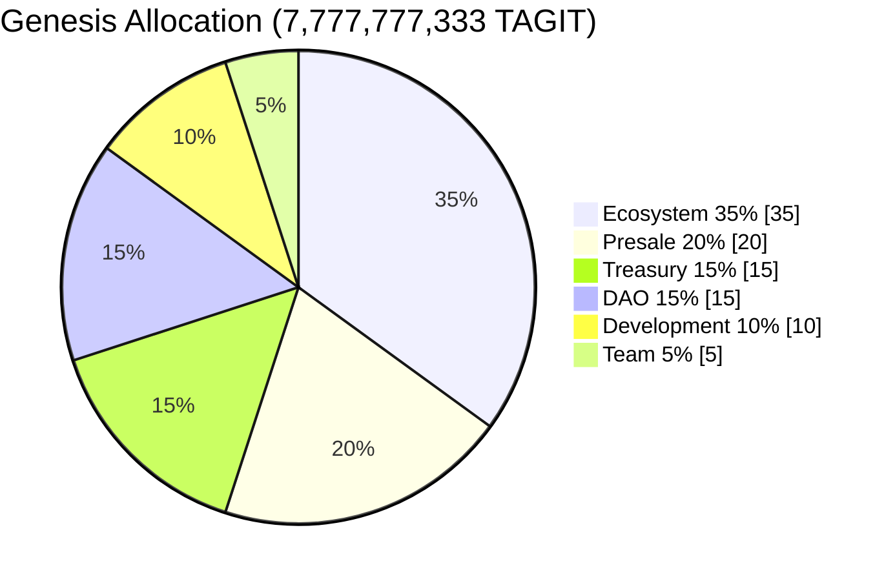
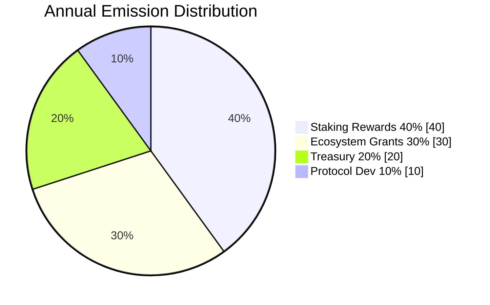
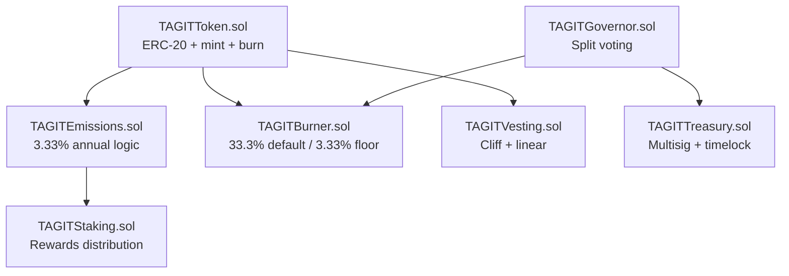

# TAGIT Token

**Last Updated:** January 2026 | **Version:** 1.1 | **Status:** ✅ Approved

The TAGIT token powers the TAG IT Network ecosystem with a carefully designed tokenomics model featuring the "Magic Number" genesis supply, controlled inflation, and deflationary burn mechanics.

---

## The Magic Number

```
🎰 7,777,777,333 TAGIT
```

The genesis supply combines **Seven Sevens** (7,777,777) with **Triple Threes** (333) — creating a unified number with complete symbolism.

```mermaid
flowchart LR
    subgraph GENESIS["🎰 GENESIS SUPPLY"]
        A["7,777,777,333"]
    end
    
    subgraph BREAKDOWN["NUMEROLOGY"]
        B["7,777,777\nSeven Sevens"]
        C["333\nTriple Threes"]
    end
    
    A --> B
    A --> C
```



---

## Core Parameters

| Parameter | Value | Symbolism |
|-----------|-------|-----------|
| **Genesis Supply** | 7,777,777,333 TAGIT | Seven Sevens + Triple Threes |
| **Inflation Rate** | 3.33% annual | Triple Threes |
| **Default Burn** | 33.3% of fees | Triple Threes |
| **Burn Floor** | 3.33% minimum | Triple Threes (immutable) |
| **Burn Ceiling** | 100% maximum | DAO-adjustable |
| **Double Time** | 21 years | 3 × 7 |

---

## Genesis Distribution



| Allocation | % | Tokens | Vesting |
|------------|---|--------|---------|
| **Ecosystem Incentives** | 35% | 2,722,222,067 | 5-year emission |
| **Presale + Liquidity** | 20% | 1,555,555,467 | TGE 20%, 12mo linear |
| **Treasury** | 15% | 1,166,666,600 | DAO-controlled |
| **DAO Governance** | 15% | 1,166,666,600 | Locked to contracts |
| **Development** | 10% | 777,777,733 | 4yr vest, 1yr cliff |
| **Team + Advisors** | 5% | 388,888,867 | 4yr vest, 1yr cliff |

> **Note:** Development allocation (777,777,733) preserves the 7s + 3s numerology!

---

## Emission Allocation (3.33% Annual)



| Category | % | Year 1 Tokens | Purpose |
|----------|---|---------------|---------|
| **Staking Rewards** | 40% | 103,644,335 | Incentivize lockup |
| **Ecosystem Grants** | 30% | 77,733,251 | Fund builders |
| **Treasury** | 20% | 51,822,167 | Operations |
| **Protocol Dev** | 10% | 25,911,084 | Core team |
| **TOTAL** | 100% | **259,110,837** | |

---

## Burn Mechanism

```mermaid
flowchart LR
    subgraph FEES["💰 Protocol Fees"]
        A["Verification"]
        B["Custody"]
        C["API"]
        D["Cross-chain"]
    end

    subgraph SPLIT["⚖️ Fee Split"]
        BURN["🔥 33.3%\nBURNED"]
        KEEP["💼 66.7%\nTreasury"]
    end

    subgraph RESULT["📉 Net Effect"]
        DEF["Deflationary\nwhen burns > emissions"]
    end

    FEES --> SPLIT
    BURN --> RESULT
```



### Burn Parameters

| Parameter | Value | Governance |
|-----------|-------|------------|
| **Default Rate** | 33.3% | DAO-adjustable |
| **Floor (Min)** | 3.33% | 🔒 Immutable |
| **Ceiling (Max)** | 100% | DAO-adjustable |

### Deflation Scenarios (Year 5)

| Scenario | Revenue | Burned | Net | Effective Rate |
|----------|---------|--------|-----|----------------|
| 🟡 Low | $300K | 100M | +196M | +2.1% |
| ⚖️ Medium | $900K | 300M | ~0 | **~0%** |
| 🟢 High | $3M | 1B | -704M | **-7.7%** |
| 🚀 Moon | $10M | 3.3B | -3B | **-33%** |

> **Deflationary Trigger:** ~$900K annual revenue flips TAGIT deflationary.

---

## Utility Functions

The TAGIT token serves four primary functions:

### 1. Metering (Gas & Fees)

| Operation | Cost |
|-----------|------|
| Verification | ~6 TAGIT |
| Custody transfer | ~5 TAGIT |
| API calls | Variable |
| Cross-chain fees | Variable |

### 2. Incentives

- Scan rewards for consumers
- Anomaly bounties for flagging counterfeits
- Data quality bonuses
- SLA performance bonuses

### 3. Staking

- Dispute resolution stakes
- Service tier access
- Validator bonds
- Recovery bonds

### 4. Access

- Premium analytics
- Higher API rate limits
- AI engine access
- Badge integration

---

## Smart Contracts



### Key Constants

```solidity
uint256 constant GENESIS_SUPPLY = 7_777_777_333 * 1e18;
uint256 constant INFLATION_RATE = 333;  // 3.33% in basis points
uint256 constant BURN_FLOOR = 333;      // 3.33% minimum
uint256 constant DEFAULT_BURN = 3330;   // 33.3% default
```

---

## Immutable Guarantees

These parameters are hardcoded and **cannot be changed**:

1. ✅ Maximum inflation: **3.33% annually**
2. ✅ Minimum burn rate: **3.33%**
3. ✅ Vesting schedules: Cannot be accelerated
4. ✅ No minting outside scheduled emissions
5. ✅ Genesis supply: **7,777,777,333**

---

## Price Milestones

```mermaid
flowchart LR
    A["$1M\n$0.000129"] --> B["$10M\n$0.00129"]
    B --> C["$100M\n$0.0129"]
    C --> D["$1B\n$0.129"]
    D --> E["$7.78B\n$1.00 🎯"]
    E --> F["$10B\n$1.29"]
```



| Market Cap | Token Price | Milestone |
|------------|-------------|-----------|
| $1M | $0.000129 | Launch |
| $10M | $0.00129 | Early traction |
| $100M | $0.0129 | Product-market fit |
| $1B | $0.129 | Established |
| **$7.78B** | **$1.00** | 🎯 **Dollar parity** |
| $10B | $1.29 | Blue chip |

---

## Supply Projection

| Year | Supply | Growth | × Genesis |
|------|--------|--------|-----------|
| 0 | 7,777,777,333 | — | 1.00× |
| 1 | 8,036,888,170 | +3.33% | 1.03× |
| 5 | 9,163,281,217 | +17.8% | 1.18× |
| 10 | 10,795,669,225 | +38.8% | 1.39× |
| 21 | 15,555,554,666 | +100% | **2.00×** |

> 🔥 With burns active, actual supply will be **lower** — potentially below genesis!

---

## The Complete Numerology

| Element | Value | Meaning |
|---------|-------|---------|
| **Genesis** | 7,777,777,333 | Unified Magic |
| **Inflation** | 3.33% | Triple Threes |
| **Default Burn** | 33.3% | Triple Threes |
| **Burn Floor** | 3.33% | Triple Threes |
| **Double Time** | 21 years | 3 × 7 |
| **Dev Allocation** | 777,777,733 | Sevens + Threes |

---

> **"Seven Sevens. Triple Threes. Pure Math."**
> 
> Every digit intentional. Every number with purpose. *The mathematics of trust.*

---

## Next Steps

- [DAO Governance](/docs/governance/dao-structure) — Multi-house voting
- [Staking Guide](/docs/tokenomics/staking) — Earn rewards
- [Smart Contracts](/docs/smart-contracts/token-contracts) — Token implementation

---

*This document contains forward-looking statements. Not investment advice.*
